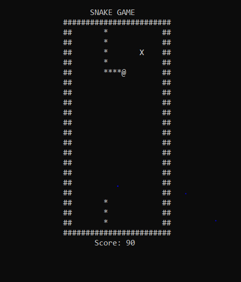
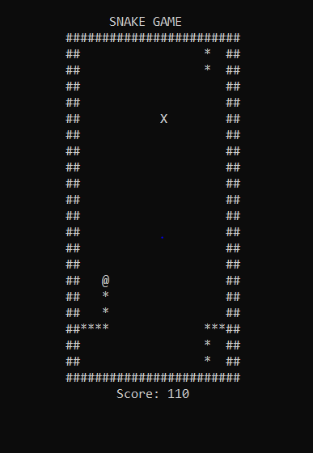

## Description

--> Designed the classical snake game using the concept of arrays and OOPS in C++.

--> The game application is built using CodeBlocks in a Windows system.

--> The source code is present in the file main.cpp

--> The game has two different levels of difficulty.

--> In the easy mode, the snake dies only when it bites back itself. 

--> In the difficult mode, the snake dies either by biting back itself or by hitting a wall of the rectangular playing area.

--> The left, right, up and down movements of the snake are controlled by 'A', 'D', 'W' and 'S' keys resepectively.

--> The game can be paused or resumed using the 'P' key.

--> The game can also be terminated midway using the 'X' key.

--> The score of the player is incremented by 10 every time the snake eats a fruit.

## Gameplay Snapshots

